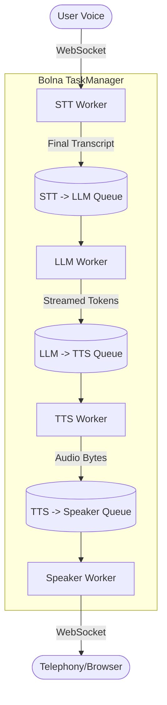

# Deep Dive: Bolna's TaskManager Async Queue Architecture

While LiveKit (Phase 6) abstracts turn-taking into WebRTC states, **Bolna** handles orchestration entirely within Python using a highly decoupled architecture based on `asyncio.Queue`. 

This is the secret sauce that allows Bolna to achieve ultra-low latency and perfect barge-in handling without crashing or jumbling audio.

## The Problem with Linear Pipelines
In Phase 1, we built a linear pipeline:
```python
text = STT()
response = LLM(text)
audio = TTS(response)
play(audio)
```
If a user interrupts during `play(audio)`, the linear pipeline has no way to cleanly halt the `LLM()` or `TTS()` tasks because they are blocking the main thread or are deeply nested.

## The Bolna Solution: Decoupled Queues
Bolna's `TaskManager` spins up isolated asynchronous worker loops that never talk to each other directly. Instead, they pass data through a series of queues:



### 1. The STT Worker
Listens to the Deepgram websocket. When it gets a **Final** transcript, it drops it into the `stt_to_llm` queue. When it gets an **Interim** transcript that indicates an interruption, it triggers a global `handle_interruption()` event.

### 2. The LLM Worker
Constantly waits on the `stt_to_llm` queue. When it gets a transcript, it asks the LLM for a response stream. As every single token arrives, it instantly drops it into the `llm_to_tts` queue.

### 3. The TTS Worker
Constantly waits on the `llm_to_tts` queue. As tokens arrive, it batches them via a text chunker (like we built in Phase 3) and sends them to ElevenLabs. As audio bytes stream back, it drops them into the `tts_to_speaker` queue.

### 4. The Speaker Worker
Constantly waits on the `tts_to_speaker` queue and writes bytes to the outbound Twilio websocket.

## How Barge-In Works in this Architecture
When the user interrupts, Bolna does **not** need to carefully unwind complex nested functions. It simply:
1. Sets a global `is_interrupted = True` flag.
2. Calls `queue.get_nowait()` in a loop to instantly empty all three queues.
3. The workers see the interrupt flag, drop whatever token/audio chunk they were currently holding, and go back to waiting on their (now empty) queues.

This decoupled architecture means an interruption at the STT level propagates to the Speaker level in **under 5 milliseconds**, ensuring the AI's voice cuts off the exact millisecond the user speaks.
